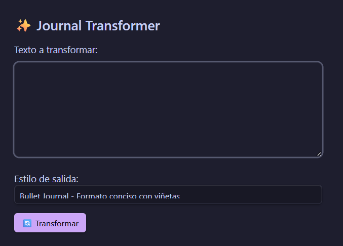

# ✨ Journal Transformer

Plugin para Obsidian que transforma texto sin procesar en entradas de diario estructuradas usando IA (Google Gemini).

## 🎯 Características

- **Transformación inteligente**: Convierte texto desordenado en entradas de diario bien estructuradas
- **4 estilos de salida**:
  - 📋 **Estructurado** - Secciones claras (Resumen, Logros, Reflexiones)
  - 💭 **Reflexivo** - Enfocado en emociones y aprendizajes
  - 📝 **Bullet Journal** - Formato conciso con viñetas
  - 📖 **Narrativo** - Historia personal fluida
- **Paso 2 - Profundización**: Genera 3 preguntas reflexivas basadas en tu contenido para enriquecer la entrada
- **Sugerencia automática de tags**
- **Integración con tu diario existente**

## 📦 Instalación

### Manual
1. Descarga los archivos `main.js`, `manifest.json` y `styles.css`
2. Crea la carpeta `.obsidian/plugins/journal-transformer/` en tu vault
3. Copia los archivos a esa carpeta
4. Reinicia Obsidian
5. Habilita el plugin en Settings → Community Plugins

## ⚙️ Configuración

1. Ve a Settings → Journal Transformer
2. Ingresa tu API Key de Google Gemini (obtener gratis en [ai.google.dev](https://ai.google.dev))
3. Configura tu carpeta de diario (por defecto: `journal/daily`)
4. Elige tu estilo preferido

## 🚀 Uso

### Opción 1: Comando
- `Ctrl+P` → "Journal Transformer: Transformar texto en entrada de diario"

### Opción 2: Selección
- Selecciona texto en cualquier nota
- `Ctrl+P` → "Journal Transformer: Transformar selección en entrada de diario"

### Flujo de trabajo
1. **Paso 1**: Escribe o pega tu texto → Click en "Transformar"
2. **Paso 2** (opcional): Click en "Profundizar" → Responde las preguntas reflexivas
3. **Paso 3**: Guarda la entrada final (copiar, insertar o crear nueva nota)

## 🔑 API Key

Este plugin usa Google Gemini (modelo `gemini-flash-latest`). 

Para obtener tu API key gratis:
1. Ve a [ai.google.dev](https://ai.google.dev)
2. Click en "Get API key"
3. Crea un nuevo proyecto o usa uno existente
4. Copia la API key y pégala en la configuración del plugin

## 📄 Licencia

MIT

## 🤝 Contribuciones

¡Pull requests bienvenidos!
